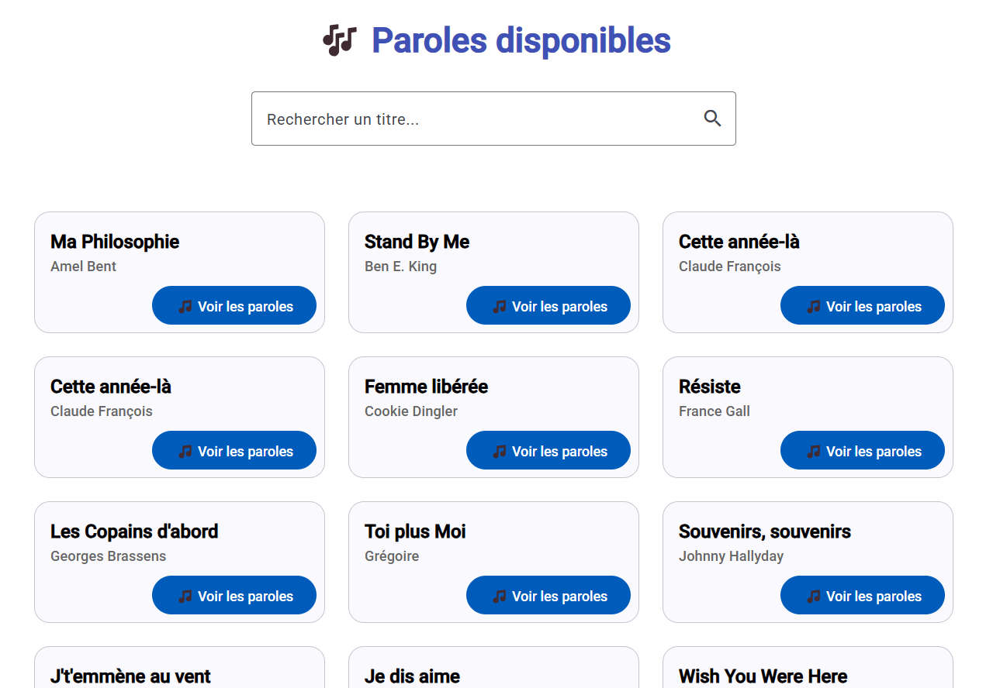
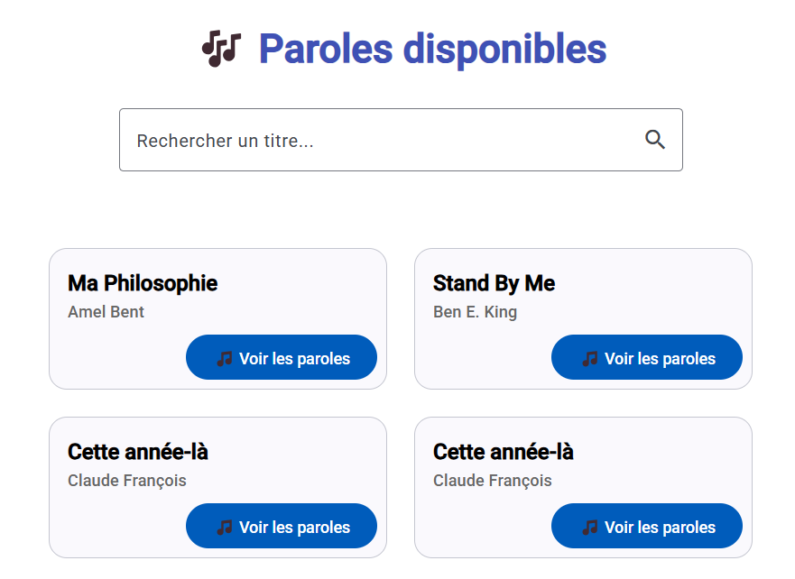
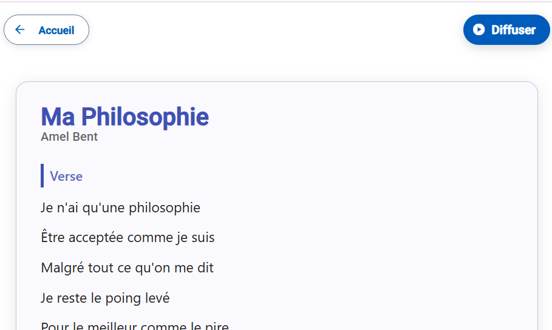
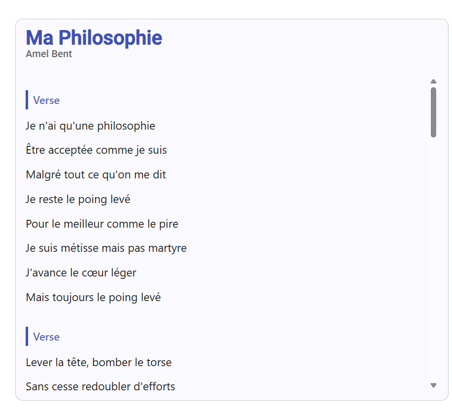

# Simple karaoke



This project was generated using [Angular CLI](https://github.com/angular/angular-cli) version 19.2.5.
## Demo

You can connect as a admin to [https://isa-anniv-app.web.app/admin](https://isa-anniv-app.web.app/admin) 



Then you can choose a music to diffuse to the users.



Click on the music you want to diffuse and then click on the button "Diffuser" to diffuse the music.


Then you can see the music is diffused to the users.
The users can see the music on their screen in real time at [https://isa-anniv-app.web.app](https://isa-anniv-app.web.app) or scan: 





## Development server

To start a local development server, run:

```bash
ng serve
```

Once the server is running, open your browser and navigate to `http://localhost:4200/`. The application will automatically reload whenever you modify any of the source files.

## Code scaffolding

Angular CLI includes powerful code scaffolding tools. To generate a new component, run:

```bash
ng generate component component-name
```

For a complete list of available schematics (such as `components`, `directives`, or `pipes`), run:

```bash
ng generate --help
```

## Building

To build the project run:

```bash
ng build
```

This will compile your project and store the build artifacts in the `dist/` directory. By default, the production build optimizes your application for performance and speed.

## Running unit tests

To execute unit tests with the [Karma](https://karma-runner.github.io) test runner, use the following command:

```bash
ng test
```

## Running end-to-end tests

For end-to-end (e2e) testing, run:

```bash
ng e2e
```

Angular CLI does not come with an end-to-end testing framework by default. You can choose one that suits your needs.

## Additional Resources

For more information on using the Angular CLI, including detailed command references, visit the [Angular CLI Overview and Command Reference](https://angular.dev/tools/cli) page.

## Deploy on Firebase
To deploy the application on Firebase, follow these steps:
1. Install Firebase CLI globally if you haven't already:

   ```bash
   npm install -g firebase-tools
   ```
2. Log in to Firebase:

   ```bash
    firebase login
    ```
3. Initialize Firebase in your project directory:
    ```bash
    firebase init
    ```
    - Choose the Firebase project you want to deploy to.
    - Select "Hosting" and follow the prompts.
4. Build your Angular project:
    ```bash
    ng build --prod
    ```
5. Deploy to Firebase:
    ```bash
    firebase deploy
    ```
6. After deployment, you will receive a hosting URL where your application is live.

## License
This project is licensed under the MIT License. See the [LICENSE](LICENSE) file for details.

## Website
The website is hosted on Firebase and can be accessed at [https://isa-anniv-app.web.app/](https://isa-anniv-app.web.app/).

